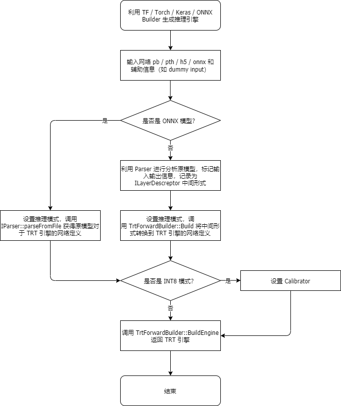

# 推理流程构建过程

## 输入要求

- `TensorFlow` 模型：要求输入二进制 `.pb` 模型
  - 如果只有 checkpoint，可以使用 `python/ckpt_to_pb.py` 将模型转化为 `.pb` 模型。
  - 如果当前模型需要满足具有多输出时，输出层不能被其他任何层作为输入层调用。例如，模型网络为 `Input->MatMul->BiasAdd`，可以生成以 `MatMul` 作为输出的 `.pb` 文件并利用 Forward 推理，不能同时将 `MatMul` 和 `BiasAdd` 作为输出层。
  - 如果需要更改模型的输出层，可以使用 `pythpb_change_output.py` 进行快速更改，即生成新模型，后续再使用 Forward 进行构建。
- `PyTorch` 模型：要求输入 `Torch Jit` 模型，对模型有一定限制，详见 [PyTorch 使用说明](torch_usage_CN.md) 。
- `Keras` 模型：要求输入 `.h5` 模型。

## 构建流程

通过 `TensorFlow` / `PyTorch` / `Keras` 模型构建推理引擎的主要流程基本一致，细节不尽相同，每一种模型拥有各自的 `Builder`(`TfBuilder` / `TorchBuilder` / `KerasBuilder`)，调用各模型定制的 `Parser` 对原模型进行分析打包，生成 `TrtNetworkDesc` 中间结构和 `std::vector<TrtLayerDesc>` 数据，并交由 `TrtForward` 类的 `Build` 方法进行 `INetworkDefinition` 的 `TensorRT` 网络构建和 `Engine` 生成。具体构流程可参考下方的流程图。

## 实现细节

### 通用模式

- 原始网络模型 -> 中间结构描述创建器 (流程图可参考[此处](../../img/forward_workflow_detail_1_CN.png))
  - 当用户导入原始网络模型时，我们会创建一个 `Parser` 类的对象 `parser`，用于将当前模型转换成网络层描述。该对象中的描述创建器管理器会对每种网络层创建器进行注册，每个创建器继承自各自命名空间下的 `ILayerDescCreator` 类，并重写基类虚函数 `Check` 和 `Create`。`Check` 函数用于检查当前结点是否符合创建器需求；`Create` 函数根据当前结点信息调用对应的创建器，返回该结点的中间形式 `TrtLayerDesc` 对象，同时将该结点的（原模型）输入结点保存到 `node_inputs` 中。需要注意的是，部分创建器是基于结点（node）的，如 `clamp_creator`，`activation_creator` 等，他们是最低层的创建器；还有一部分创建器是基于 module 的，如 `bert_creator`、`lrn_creator` 等，他们的 `Check` 函数会检查当前结点及之前的多个结点。一般来说，基于 module 的创建器在后续构建网络时优化程度更高，应当优先被检查，即在创建 `Parser` 类的对象时被优先注册。
  - `parser` 会先调用 `Graph::Load` 函数将原始网络模型转换成 `Graph` 类的对象 `graph_`，随后调用 `Graph::ExtractGraphInfos` 函数提取输入结点和输出结点信息，并分别保存到 `inputs_` 和 `outputs_` 对象中。
  - 对于所有的输入结点，我们调用 `Parser::CreateInputDescs` 函数，根据 `batch_size` 创建 `InputDescs`，同时我们还会维护一张哈希表 `created_desc_map_`，保存输入结点和网络层描述的映射关系；对于其他所有结点网络层描述的创建，由于我们在上一步保存了所有输出结点信息，这里采用了自底向上的搜索方式，即从输出结点开始，直到搜索到输入结点为止。这一递归过程通过 `Parser::ParseOperaion` 函数完成，在递归的过程中，我们不断地保存当前结点的输入结点信息，并创建对应的网络层描述，最终我们可以得到一个能够描述整个模型的对象 `network_`。具体递归流程可参考下方的伪代码。
  
- 中间结构描述创建器 -> `TensorRT` 网络层创建器 (流程图可参考[此处](../../img/forward_workflow_detail_2_CN.png))
  - 当 `parser` 完成对原始网络模型的解析后，我们还需要创建一个 `TrtNetworkCreator` 类的对象 `creator`，用于将原始网络模型的网络层描述 `network_` 转换成 `TensorRT` 推理引擎。这一过程与上一小节中的创建器类似，都是先注册对应网络层的创建器，再进行后续的查找。由于创建器已经指定了对应格式的 `TrtLayerDesc`，因此创建器不再需要 `Check` 函数，可以直接通过层级名字获取。由于层级描述已经统一，这里的实现过程较上一节中的创建器更加简单，用户无需额外关注。
- 网络层插件
  - 对于一些特殊层，我们使用了插件形式对这些层进行了支持。开发新的插件一般需要满足以下条件之一：
    - 使用 `TensorRT` 自带的 `Layer` 不能支持或拼接表示出需要的层；
    - 使用 `TensorRT` 自带的 `Layer` 实现效率较低；
    - 使用 `TensorRT` 自带的 `Layer` 进行拼接表示的流程过长，既不利于提速，又不利于后续开发维护。
  - 在我们的测试中，`Gather` 层用于 `Embedding` 时的表现较差，另外 `Padding` 层支持的模式有限，基于类似的原因开发或加入了多款插件，详见目录 `source\trt_engine\trt_network_crt\plugins` 。

### 模型相关

- 与 `TensorFlow` 模型相关
  - 对于图片输入的 CV 网络，`TF` 默认的输入格式为 `NHWC`，因此构建网络时，我们将四维的输入做了一个转置，使其输入格式变为 `NCHW`。这个改动对于其他的四维输入会有不正确的影响，需要在未来修复。
  - 对于 `IteratorGetNext` 这样单个结点中有多个输入的情况，会用专门的负数 `input_reference_` 标记其位置。当其被引用后恢复为正数，这样能够保证后续查找 `UnusedInputs` 能正常工作。同时，在调用 `ParseOperaion` 函数时也要对其进行专门处理，以保证获得正确的输入对应。
  - `TensorFlow` 网络中的 `weights` 利用 `TF` 的 `TF_TryEvaluateConstant` API 进行获取（调用链：`tf::Output::GetConstantTensor->TF_TryEvaluateConstant`）。对于具有较大参数的 `TF` 网络，请使用 `ckpt_to_pb.py` 进行模型转换，脚本会自动将较大的参数单独提取成文件，避免读入此类模型时出现内存相关的问题。
- 与 `PyTorch` 模型相关
  - `PyTorch` 的 C++ API 提供了 `FuseLinear` 的优化，可以帮助将线性层合并，在分析网络时首先使用该优化可以降低分析的复杂程度。在更高的 `PyTorch` 版本（>=1.7）中还有 `Inline` 和 `FoldFloorDivide` 等其他优化，也可以使用。
  - 在进行网络分析前需要调用 `GraphUtils::EvalAll` 函数，该函数依次将每个结点作为输出，然后运行网络，以此得到每个结点的输出值。这一操作的主要目的是获取 `PyTorch` 各个常量层的数据值。对于大型网络，这一步骤需要等待一定的时间。
  - 在调用完 `GraphUtils::EvalAll` 之后还需要调用 `GraphUtils::RemoveRedundantNodes` 函数来移除部分冗余结点，这部分结点非常影响网络分析，详见代码内的注释。