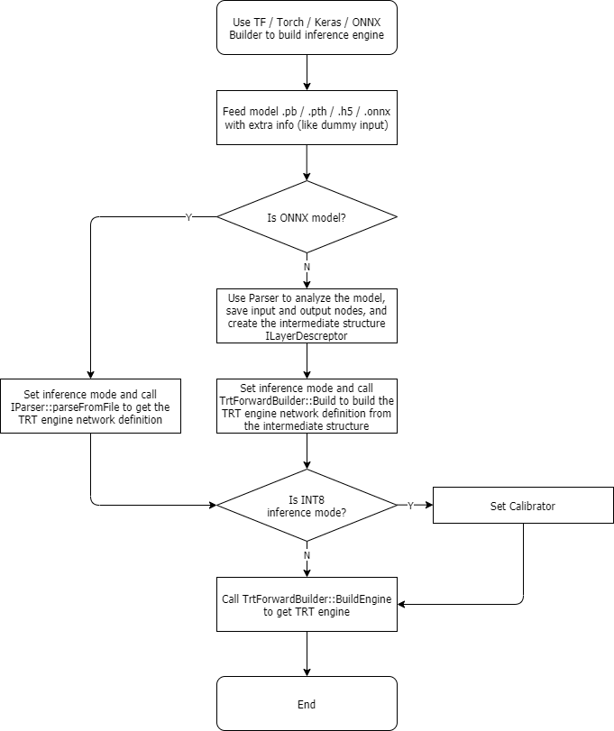
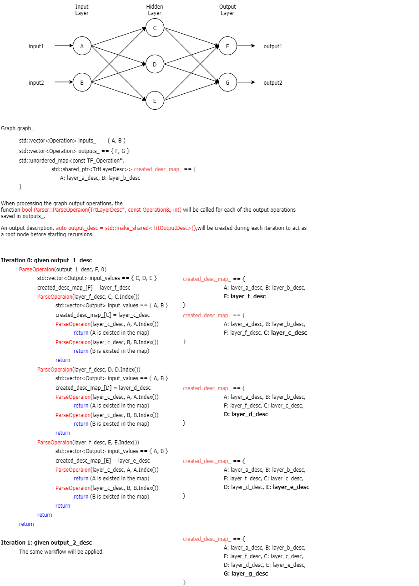

# Forward Workflow

## Input Rerequirements

- TensorFlow: require a binary `.pb` model
  - If you only have a checkpoint, you can use `python/ckpt_to_pb.py` to convert the model to a `.pb` model.
  - If the model needs to have multiple outputs, the output layer cannot be used by any other layer as the input layer. For example, if the model is `Input->MatMul->BiasAdd`, you can generate `.pb` files with `MatMul` as output and then use Forward for inference. You cannot use `MatMul` and `BiasAdd` as output layers at the same time.
  - If you need to change the output layer of the model, you can use `pythpb_change_output.py` to make quick changes, that is, to generate a new model, and then use Forward to build it later.
- PyTorch: require a `Torch Jit` model; some restrictions may applied, refer to [PyTorch Usage](torch_usage_CN.md).
- Keras: require a `.h5` model.
- ONNX: require a `.onnx` model.

## Build Workflow

The build workflow of building an inference engine through the `TensorFlow` / `PyTorch` / `Keras` / `ONNX` model is basically the same, with different implementation details. Each model has its own `Builder` (`TfBuilder` / `TorchBuilder` / `KerasBuilder` / `OnnxBuilder`) and calls its customized `Parser` to analyze and package the original model. The `Builder` generates an intermediate structure `TrtNetworkDesc`, which includes layer descriptions `std::vector<TrtLayerDesc>`, and then hand it over to the `Build` method of the `TrtForward` class to construct the `TensorRT` network inherited from the `INetworkDefinition` class and generate the corresponding `Engine` (`OnnxBuilder` will omit some steps). Please refer to the flow chart below for the overall workflow.

## Implementation Details

### General Pattern

- Original Network Model -> Intermediate Structure Description Creator (Refer to the flow chart [here](../../img/forward_workflow_detail_1_EN.png))
  - When the user imports the original network model, we will create an object `parser` of the `Parser` class, which is used to convert the model into a network layer description. The description creator manager of this object will register each network layer creator, which is inherited from the `ILayerDescCreator` class under its respective namespace, and overrides the base class virtual functions `Check` and `Create`. The `Check` function is used to check whether the current node meets the requirements of the creator; the `Create` function calls the corresponding creator according to the current node information, saves the input nodes of the current node in `node_inputs`, and returns the intermediate form of the node `TrtLayerDesc` object. To be noticed, some creators are based on nodes, such as `clamp_creator`, `activation_creator`, etc, and they are the lowest level creators; some creators are based on modules, such as `bert_creator`, `lrn_creator` etc., and their `Check` functions will check the current node plus multiple previous nodes. Generally speaking, the module-based creator can be optimized much more when building the network later and should be checked first. That's to say, they should be registered first when creating objects of the `Parser` class.
  - `parser` will first call the `Graph::Load` function to convert the original network model into a `Graph` object `graph_` and then call the `Graph::ExtractGraphInfos` function to extract the input and output nodes' information. During this process, it will save all the information to `inputs_` and `outputs_` objects respectively.
  - For all input nodes, we will call the `Parser::CreateInputDescs` function to create `InputDescs` according to `batch_size` and will also maintain a hash table `created_desc_map_` to save the relationship of input nodes and network layer descriptions. For the creation of all other node network layer descriptions, since we saved all output nodes' information in the previous step, a bottom-up search method is used here, that is, starting from the output nodes until reaching the input nodes. This recursive process is completed by the `Parser::ParseOperaion` function. In the recursive process, we continuously save the input nodes' information of the current node and create the corresponding layer description. Finally, we can get a network description `network_` that can describe the entire model. The recursive process can refer to the pseudo-code below.
  
- Intermediate Structure Description Creator -> `TensorRT` Network Layer Creator (Refer to the flow chart [here](../../img/forward_workflow_detail_2_EN.png))
  - When the `parser` completes the analysis of the original network model, we also need to create an object `creator` of the `TrtNetworkCreator` class, which is used to convert the network layer description `network_` of the original network model into a `TensorRT` inference engine. This process is similar to the creator in the previous section, in that the creator of the corresponding network layer is registered first, and then the subsequent search is performed. Since the creator has specified the `TrtLayerDesc` of the corresponding format, the creator no longer needs the `Check` function and can be obtained directly by the layer name. Since the level description has been unified, the implementation process here is simpler than the creator in the previous section, and users do not need to pay extra attention.
- Network Layer Plugins
  - For some special layers, we use plugins to support them. The development of a new plugin generally needs to meet one of the following conditions:
    - Cannot support or splice the required layer through the `Layer` provided by `TensorRT`;
    - Low efficiency through the `Layer` provided by `TensorRT`;
    - Long wait time for splicing representation through the `Layer` provided by `TensorRT`, which is not conducive to speed up and subsequent development and maintenance.
  - In our test, the `Gather` layer performs poorly when used in `Embedding` and the mode supported by the `Padding` layer is limited. Based on similar reasons, we have developed and introduced many plugins. More information can be founded under the `source\trt_engine for details. \trt_network_crt\plugins` folder.

### Model Related

- TensorFlow
  - For the CV model with image inputs, the default input format of `TF` is `NHWC`. So when constructing the network, we transpose the four-dimensional input so that its input format becomes `NCHW`. This change will have an incorrect impact on other 4D inputs and needs to be fixed in the future.
  - For `IteratorGetNext`, where there are multiple inputs in a single node, a special negative number `input_reference_` will be used to mark its position. When it is quoted, it is restored to a positive number, which can ensure that the subsequent search for `UnusedInputs` can work normally. At the same time, it must be specially processed when calling the `ParseOperaion` function to ensure that the correct input correspondence is obtained.
  - The `weights` in the `TensorFlow` network are obtained by using the `TF_TryEvaluateConstant` API of `TF` (call chain: `tf::Output::GetConstantTensor->TF_TryEvaluateConstant`). For the `TF` network with larger parameters, please use `ckpt_to_pb.py` for model conversion. The script will automatically extract the larger parameters into files separately to avoid memory-related problems when reading.
- PyTorch
  - The `PyTorch` C++ API provides the optimization of `FuseLinear`, which can help to merge the linear layers. When analyzing the network, this optimization should be used first to reduce the analysis complexity. In higher versions of `PyTorch` (>=1.7), there are other optimizations such as `Inline` and `FoldFloorDivide`, which can also be used.
  - Before analyzing the network, you need to call the `GraphUtils::EvalAll` function, which takes each node as an output in turn, and then runs the network to get the output of each node. The main purpose of this operation is to obtain the data values of each constant layer of `PyTorch`. For large networks, this step requires a certain amount of time to wait.
  - After calling the `GraphUtils::EvalAll` function, you need to call the `GraphUtils::RemoveRedundantNodes` function to remove some redundant nodes. This part of the nodes greatly affects network analysis. Please refer to the comments in the code for details.
- ONNX
  - When parsing the ONNX model, `OnnxBuilder` directly calls the `nvonnxparser::createParser` and `nvonnxparser::IParser::parseFromFile` interfaces provided in `NvOnnxParser.h`, omitting the first step in the General Pattern and several procedures of generating the network definition in the second step, because these interfaces can directly return the network definition `nvinfer1::INetworkDefinition` of the original model. After obtaining it, `OnnxBuilder` will directly call the `nvinfer1::builder::buildEngine` interface to generate the TRT engine.
